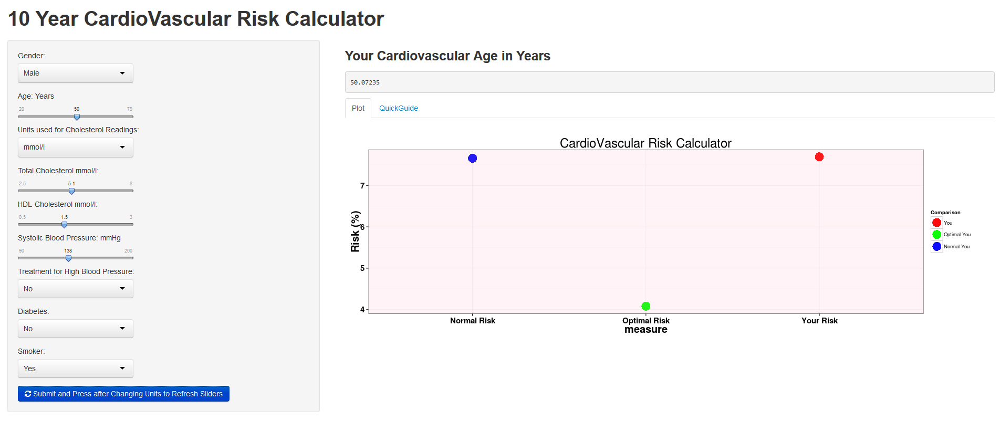

CardioVascular Risk 
========================================================


author: Tony Davidson

date: `r format (Sys.Date(),format="%B %d %Y")`

output:
  ioslides_presentation:
    logo: PenRose-01
    
What is Cardio Vascular Disease?
========================================================
transition:rotate


***
Cardio Vascular disease is a complicated way of saying there are problems with your heart and blood systems.


- It is the biggest cause of death world wide
- Since the 70's the mortality rates have been declining.
- What can you do to reduce your risk?


The CVR Calculator (Drivers)
========================================================

Key Drivers of Cardio Vascular Disease


You're Stuck with 

-sex

-age

***

You can Control (to some extent)

-Weight

-Cholesterol Levels (good and bad)

-Whether you smoke or not

-Blood Pressure

-Diabetes (Some genetic predisposition but can be minimised)


Your 10 year Cardio Vascular Risk
========================================================
transition:rotate
50 Year Old Woman Average Weight, Blood Pressure, Cholesterol Level. She is a smoker.

Her % Risk of having a Cardio Vascular episode is:
```{r, echo=FALSE}
# ~~~~~~~~~~~~~~~~~~~~~~~~~~~~~~~~~~~~~~~~~~~~~~~~~~~~~~~~~~~~~~~~~~~~~~~~~~~~~~
# CardioVascular Risk Calculator
# https://www.framinghamheartstudy.org/risk-functions/cardiovascular-disease/10-year-risk.php
# Based on Framington Heart Study
# excel spreadsheets to derive calculations downloaded 2014-09-03 @ 7:41 GMT +8hrs
# 
# ~~~~~~~~~~~~~~~~~~~~~~~~~~~~~~~~~~~~~~~~~~~~~~~~~~~~~~~~~~~~~~~~~~~~~~~~~~~~~~
# This file is written for the purpose of data visualization.The calculations are as per the Framingham
# Study and should be viewed as a guide only.
# ~~~~~~~~~~~~~~~~~~~~~~~~~~~~~~~~~~~~~~~~~~~~~~~~~~~~~~~~~~~~~~~~~~~~~~~~~~~~~~
library(shiny)
library(ggplot2)
library(markdown)
# Define server logic required to summarize and view the selected dataset
# input ----
age <- 50
male <- 1
cholesterol <- 180
hdl <- 45
sbp <- 125
treatment <- 1
diabetes <- 1
smoker <- 1


# input ----


 


# actual
# construct from input
lnage <- log(age)
lntot <- log(cholesterol)
lnhdl <- log(hdl)
lnsbp <- log(sbp)

constlntot<-log(180)
constlnhdl <- log(45)
constlnsbp <- log(125)


Coeff.m.NoTreat.Age <-3.06117
Coeff.m.NoTreat.sbp <-1.93303
Coeff.m.NoTreat.tot <-1.1237
Coeff.m.NoTreat.hdl <--0.93263
Coeff.m.NoTreat.smoke <-0.65451
Coeff.m.Treat.sbp <-1.99881
Coeff.m.Treat.diab <-0.57367
m.Constant<- 23.9802

Coeff.f.NoTreat.Age <-2.32888
Coeff.f.NoTreat.sbp <-2.76157
Coeff.f.NoTreat.tot <-1.20904
Coeff.f.NoTreat.hdl <--0.70833
Coeff.f.NoTreat.smoke <-0.52873
Coeff.f.Treat.sbp <-2.82263
Coeff.f.Treat.diab <-0.69154
f.Constant<- 26.1931

ConstiNum.f <- exp(-((Coeff.f.NoTreat.sbp*constlnsbp+Coeff.f.NoTreat.tot*constlntot+Coeff.f.NoTreat.hdl*constlnhdl-f.Constant)/2.32888))
a.f<--log(0.95012)
b.f<-(1/2.32888)
ConstiDenom.f <- a.f^b.f
Consti.f <- ConstiNum.f/ConstiDenom.f
Expo.f <-  1/2.328888
EpsBetx.f <- (lnage*Coeff.f.NoTreat.Age+Coeff.f.NoTreat.sbp*lnsbp+Coeff.f.NoTreat.tot*lntot+Coeff.f.NoTreat.hdl*lnhdl+Coeff.f.NoTreat.smoke*smoker+Coeff.f.Treat.diab*diabetes)
Exp.f<-exp(EpsBetx.f-26.1931)
RiskScore.f<-1-(0.95012^Exp.f)
Term.f <- (-log(1-RiskScore.f))^Expo.f
HeartAge.f <- Consti.f*Term.f


ConstiNum.m <- exp(-((Coeff.m.NoTreat.sbp*constlnsbp+Coeff.m.NoTreat.tot*constlntot+Coeff.m.NoTreat.hdl*constlnhdl-m.Constant)/3.06117))
a.m<--log(0.88936)
b.m<-(1/3.06117)
ConstiDenom.m <- a.m^b.m
Consti.m <- ConstiNum.m/ConstiDenom.m
Expo.m <-  1/3.06117
EpsBetx.m <- (lnage*Coeff.m.NoTreat.Age+Coeff.m.NoTreat.sbp*lnsbp+Coeff.m.NoTreat.tot*lntot+Coeff.m.NoTreat.hdl*lnhdl+Coeff.m.Treat.diab*diabetes+Coeff.m.NoTreat.smoke*smoker)
Exp.m<-exp(EpsBetx.m-23.9802)
RiskScore.m<-1-(0.88936^Exp.m)
Term.m <- (-log(1-RiskScore.m))^Expo.m
HeartAge.m <- Consti.m*Term.m


ConstiNum.f.treatbp <- exp(-((Coeff.f.Treat.sbp*constlnsbp+Coeff.f.NoTreat.tot*constlntot+Coeff.f.NoTreat.hdl*constlnhdl-f.Constant)/2.32888))
a.f<--log(0.95012)
b.f<-(1/2.32888)
ConstiDenom.f <- a.f^b.f
Consti.f.treatbp <- ConstiNum.f/ConstiDenom.f
Expo.f <-  1/2.328888
EpsBetx.f.treatbp <- (lnage*Coeff.f.NoTreat.Age+Coeff.f.Treat.sbp*lnsbp+Coeff.f.NoTreat.tot*lntot+Coeff.f.NoTreat.hdl*lnhdl+Coeff.f.Treat.diab*diabetes+Coeff.f.NoTreat.smoke*smoker)
Exp.f.treatbp<-exp(EpsBetx.f.treatbp-26.1931)
RiskScore.f.treatbp<-1-(0.95012^Exp.f.treatbp)
Term.f.treatbp <- (-log(1-RiskScore.f.treatbp))^Expo.f
HeartAge.f.treatbp <- Consti.f.treatbp*Term.f.treatbp


ConstiNum.m.treatbp <- exp(-(Coeff.m.Treat.sbp*constlnsbp+Coeff.m.NoTreat.tot*constlntot+Coeff.m.NoTreat.hdl*constlnhdl-m.Constant)/3.06117)
a.m<--log(0.88936)
b.m<-(1/3.06117)
ConstiDenom.m <- a.m^b.m
Consti.m.treatbp <- ConstiNum.m/ConstiDenom.m
Expo.m <-  1/3.06117
EpsBetx.m.treatbp<-(lnage*Coeff.m.NoTreat.Age+Coeff.m.Treat.sbp*lnsbp+Coeff.m.NoTreat.tot*lntot+Coeff.m.NoTreat.hdl*lnhdl+Coeff.m.Treat.diab*diabetes+Coeff.m.NoTreat.smoke*smoker)
Exp.m.treatbp<-exp(EpsBetx.m.treatbp-23.9802)
RiskScore.m.treatbp<-1-(0.88936^Exp.m.treatbp)
Term.m.treatbp <- (-log(1-RiskScore.m.treatbp))^Expo.m
HeartAge.m.treatbp <- Consti.m.treatbp*Term.m.treatbp


cvr <- ifelse(male==1 & treatment==1 ,HeartAge.f,
ifelse(male==1 & treatment==0 ,HeartAge.f.treatbp,
ifelse(male==0 & treatment==1 ,HeartAge.m,
ifelse(male==0 & treatment==0 ,HeartAge.m.treatbp,
NA))))


#Risk Score


RiskScore <- ifelse(male==1 & treatment==1 ,RiskScore.f,
ifelse(male==1 & treatment==0 ,RiskScore.f.treatbp,
ifelse(male==0 & treatment==1 ,RiskScore.m,
ifelse(male==0 & treatment==0 ,RiskScore.m.treatbp,
NA))))
RiskScore*100
```
After she gives up smoking her % risk of a Cardio Vascular event is:
```{r, echo=FALSE}
# ~~~~~~~~~~~~~~~~~~~~~~~~~~~~~~~~~~~~~~~~~~~~~~~~~~~~~~~~~~~~~~~~~~~~~~~~~~~~~~
# CardioVascular Risk Calculator
# https://www.framinghamheartstudy.org/risk-functions/cardiovascular-disease/10-year-risk.php
# Based on Framington Heart Study
# excel spreadsheets to derive calculations downloaded 2014-09-03 @ 7:41 GMT +8hrs
# 
# ~~~~~~~~~~~~~~~~~~~~~~~~~~~~~~~~~~~~~~~~~~~~~~~~~~~~~~~~~~~~~~~~~~~~~~~~~~~~~~
# This file is written for the purpose of data visualization.The calculations are as per the Framingham
# Study and should be viewed as a guide only.
# ~~~~~~~~~~~~~~~~~~~~~~~~~~~~~~~~~~~~~~~~~~~~~~~~~~~~~~~~~~~~~~~~~~~~~~~~~~~~~~
library(shiny)
library(ggplot2)
library(markdown)
# Define server logic required to summarize and view the selected dataset
# input ----
age <- 50
male <- 1
cholesterol <- 180
hdl <- 45
sbp <- 125
treatment <- 1
diabetes <- 1
smoker <- 0


# input ----


 


# actual
# construct from input
lnage <- log(age)
lntot <- log(cholesterol)
lnhdl <- log(hdl)
lnsbp <- log(sbp)

constlntot<-log(180)
constlnhdl <- log(45)
constlnsbp <- log(125)


Coeff.m.NoTreat.Age <-3.06117
Coeff.m.NoTreat.sbp <-1.93303
Coeff.m.NoTreat.tot <-1.1237
Coeff.m.NoTreat.hdl <--0.93263
Coeff.m.NoTreat.smoke <-0.65451
Coeff.m.Treat.sbp <-1.99881
Coeff.m.Treat.diab <-0.57367
m.Constant<- 23.9802

Coeff.f.NoTreat.Age <-2.32888
Coeff.f.NoTreat.sbp <-2.76157
Coeff.f.NoTreat.tot <-1.20904
Coeff.f.NoTreat.hdl <--0.70833
Coeff.f.NoTreat.smoke <-0.52873
Coeff.f.Treat.sbp <-2.82263
Coeff.f.Treat.diab <-0.69154
f.Constant<- 26.1931

ConstiNum.f <- exp(-((Coeff.f.NoTreat.sbp*constlnsbp+Coeff.f.NoTreat.tot*constlntot+Coeff.f.NoTreat.hdl*constlnhdl-f.Constant)/2.32888))
a.f<--log(0.95012)
b.f<-(1/2.32888)
ConstiDenom.f <- a.f^b.f
Consti.f <- ConstiNum.f/ConstiDenom.f
Expo.f <-  1/2.328888
EpsBetx.f <- (lnage*Coeff.f.NoTreat.Age+Coeff.f.NoTreat.sbp*lnsbp+Coeff.f.NoTreat.tot*lntot+Coeff.f.NoTreat.hdl*lnhdl+Coeff.f.NoTreat.smoke*smoker+Coeff.f.Treat.diab*diabetes)
Exp.f<-exp(EpsBetx.f-26.1931)
RiskScore.f<-1-(0.95012^Exp.f)
Term.f <- (-log(1-RiskScore.f))^Expo.f
HeartAge.f <- Consti.f*Term.f


ConstiNum.m <- exp(-((Coeff.m.NoTreat.sbp*constlnsbp+Coeff.m.NoTreat.tot*constlntot+Coeff.m.NoTreat.hdl*constlnhdl-m.Constant)/3.06117))
a.m<--log(0.88936)
b.m<-(1/3.06117)
ConstiDenom.m <- a.m^b.m
Consti.m <- ConstiNum.m/ConstiDenom.m
Expo.m <-  1/3.06117
EpsBetx.m <- (lnage*Coeff.m.NoTreat.Age+Coeff.m.NoTreat.sbp*lnsbp+Coeff.m.NoTreat.tot*lntot+Coeff.m.NoTreat.hdl*lnhdl+Coeff.m.Treat.diab*diabetes+Coeff.m.NoTreat.smoke*smoker)
Exp.m<-exp(EpsBetx.m-23.9802)
RiskScore.m<-1-(0.88936^Exp.m)
Term.m <- (-log(1-RiskScore.m))^Expo.m
HeartAge.m <- Consti.m*Term.m


ConstiNum.f.treatbp <- exp(-((Coeff.f.Treat.sbp*constlnsbp+Coeff.f.NoTreat.tot*constlntot+Coeff.f.NoTreat.hdl*constlnhdl-f.Constant)/2.32888))
a.f<--log(0.95012)
b.f<-(1/2.32888)
ConstiDenom.f <- a.f^b.f
Consti.f.treatbp <- ConstiNum.f/ConstiDenom.f
Expo.f <-  1/2.328888
EpsBetx.f.treatbp <- (lnage*Coeff.f.NoTreat.Age+Coeff.f.Treat.sbp*lnsbp+Coeff.f.NoTreat.tot*lntot+Coeff.f.NoTreat.hdl*lnhdl+Coeff.f.Treat.diab*diabetes+Coeff.f.NoTreat.smoke*smoker)
Exp.f.treatbp<-exp(EpsBetx.f.treatbp-26.1931)
RiskScore.f.treatbp<-1-(0.95012^Exp.f.treatbp)
Term.f.treatbp <- (-log(1-RiskScore.f.treatbp))^Expo.f
HeartAge.f.treatbp <- Consti.f.treatbp*Term.f.treatbp


ConstiNum.m.treatbp <- exp(-(Coeff.m.Treat.sbp*constlnsbp+Coeff.m.NoTreat.tot*constlntot+Coeff.m.NoTreat.hdl*constlnhdl-m.Constant)/3.06117)
a.m<--log(0.88936)
b.m<-(1/3.06117)
ConstiDenom.m <- a.m^b.m
Consti.m.treatbp <- ConstiNum.m/ConstiDenom.m
Expo.m <-  1/3.06117
EpsBetx.m.treatbp<-(lnage*Coeff.m.NoTreat.Age+Coeff.m.Treat.sbp*lnsbp+Coeff.m.NoTreat.tot*lntot+Coeff.m.NoTreat.hdl*lnhdl+Coeff.m.Treat.diab*diabetes+Coeff.m.NoTreat.smoke*smoker)
Exp.m.treatbp<-exp(EpsBetx.m.treatbp-23.9802)
RiskScore.m.treatbp<-1-(0.88936^Exp.m.treatbp)
Term.m.treatbp <- (-log(1-RiskScore.m.treatbp))^Expo.m
HeartAge.m.treatbp <- Consti.m.treatbp*Term.m.treatbp


cvr <- ifelse(male==1 & treatment==1 ,HeartAge.f,
ifelse(male==1 & treatment==0 ,HeartAge.f.treatbp,
ifelse(male==0 & treatment==1 ,HeartAge.m,
ifelse(male==0 & treatment==0 ,HeartAge.m.treatbp,
NA))))


#Risk Score


RiskScore <- ifelse(male==1 & treatment==1 ,RiskScore.f,
ifelse(male==1 & treatment==0 ,RiskScore.f.treatbp,
ifelse(male==0 & treatment==1 ,RiskScore.m,
ifelse(male==0 & treatment==0 ,RiskScore.m.treatbp,
NA))))
RiskScore*100
```
***
40 Year Old Man High Blood Pressure (Systolic 18) mmHg),  Average Blood Pressure and Cholesterol Level. 

His Cardio Vascular Risk is:
```{r, echo=FALSE}
# ~~~~~~~~~~~~~~~~~~~~~~~~~~~~~~~~~~~~~~~~~~~~~~~~~~~~~~~~~~~~~~~~~~~~~~~~~~~~~~
# CardioVascular Risk Calculator
# https://www.framinghamheartstudy.org/risk-functions/cardiovascular-disease/10-year-risk.php
# Based on Framington Heart Study
# excel spreadsheets to derive calculations downloaded 2014-09-03 @ 7:41 GMT +8hrs
# 
# ~~~~~~~~~~~~~~~~~~~~~~~~~~~~~~~~~~~~~~~~~~~~~~~~~~~~~~~~~~~~~~~~~~~~~~~~~~~~~~
# This file is written for the purpose of data visualization.The calculations are as per the Framingham
# Study and should be viewed as a guide only.
# ~~~~~~~~~~~~~~~~~~~~~~~~~~~~~~~~~~~~~~~~~~~~~~~~~~~~~~~~~~~~~~~~~~~~~~~~~~~~~~
library(shiny)
library(ggplot2)
library(markdown)
# Define server logic required to summarize and view the selected dataset
# input ----
age <- 40
male <- 0
cholesterol <- 180
hdl <- 45
sbp <- 180
treatment <- 1
diabetes <- 1
smoker <- 0


# input ----


 


# actual
# construct from input
lnage <- log(age)
lntot <- log(cholesterol)
lnhdl <- log(hdl)
lnsbp <- log(sbp)

constlntot<-log(180)
constlnhdl <- log(45)
constlnsbp <- log(125)


Coeff.m.NoTreat.Age <-3.06117
Coeff.m.NoTreat.sbp <-1.93303
Coeff.m.NoTreat.tot <-1.1237
Coeff.m.NoTreat.hdl <--0.93263
Coeff.m.NoTreat.smoke <-0.65451
Coeff.m.Treat.sbp <-1.99881
Coeff.m.Treat.diab <-0.57367
m.Constant<- 23.9802

Coeff.f.NoTreat.Age <-2.32888
Coeff.f.NoTreat.sbp <-2.76157
Coeff.f.NoTreat.tot <-1.20904
Coeff.f.NoTreat.hdl <--0.70833
Coeff.f.NoTreat.smoke <-0.52873
Coeff.f.Treat.sbp <-2.82263
Coeff.f.Treat.diab <-0.69154
f.Constant<- 26.1931

ConstiNum.f <- exp(-((Coeff.f.NoTreat.sbp*constlnsbp+Coeff.f.NoTreat.tot*constlntot+Coeff.f.NoTreat.hdl*constlnhdl-f.Constant)/2.32888))
a.f<--log(0.95012)
b.f<-(1/2.32888)
ConstiDenom.f <- a.f^b.f
Consti.f <- ConstiNum.f/ConstiDenom.f
Expo.f <-  1/2.328888
EpsBetx.f <- (lnage*Coeff.f.NoTreat.Age+Coeff.f.NoTreat.sbp*lnsbp+Coeff.f.NoTreat.tot*lntot+Coeff.f.NoTreat.hdl*lnhdl+Coeff.f.NoTreat.smoke*smoker+Coeff.f.Treat.diab*diabetes)
Exp.f<-exp(EpsBetx.f-26.1931)
RiskScore.f<-1-(0.95012^Exp.f)
Term.f <- (-log(1-RiskScore.f))^Expo.f
HeartAge.f <- Consti.f*Term.f


ConstiNum.m <- exp(-((Coeff.m.NoTreat.sbp*constlnsbp+Coeff.m.NoTreat.tot*constlntot+Coeff.m.NoTreat.hdl*constlnhdl-m.Constant)/3.06117))
a.m<--log(0.88936)
b.m<-(1/3.06117)
ConstiDenom.m <- a.m^b.m
Consti.m <- ConstiNum.m/ConstiDenom.m
Expo.m <-  1/3.06117
EpsBetx.m <- (lnage*Coeff.m.NoTreat.Age+Coeff.m.NoTreat.sbp*lnsbp+Coeff.m.NoTreat.tot*lntot+Coeff.m.NoTreat.hdl*lnhdl+Coeff.m.Treat.diab*diabetes+Coeff.m.NoTreat.smoke*smoker)
Exp.m<-exp(EpsBetx.m-23.9802)
RiskScore.m<-1-(0.88936^Exp.m)
Term.m <- (-log(1-RiskScore.m))^Expo.m
HeartAge.m <- Consti.m*Term.m


ConstiNum.f.treatbp <- exp(-((Coeff.f.Treat.sbp*constlnsbp+Coeff.f.NoTreat.tot*constlntot+Coeff.f.NoTreat.hdl*constlnhdl-f.Constant)/2.32888))
a.f<--log(0.95012)
b.f<-(1/2.32888)
ConstiDenom.f <- a.f^b.f
Consti.f.treatbp <- ConstiNum.f/ConstiDenom.f
Expo.f <-  1/2.328888
EpsBetx.f.treatbp <- (lnage*Coeff.f.NoTreat.Age+Coeff.f.Treat.sbp*lnsbp+Coeff.f.NoTreat.tot*lntot+Coeff.f.NoTreat.hdl*lnhdl+Coeff.f.Treat.diab*diabetes+Coeff.f.NoTreat.smoke*smoker)
Exp.f.treatbp<-exp(EpsBetx.f.treatbp-26.1931)
RiskScore.f.treatbp<-1-(0.95012^Exp.f.treatbp)
Term.f.treatbp <- (-log(1-RiskScore.f.treatbp))^Expo.f
HeartAge.f.treatbp <- Consti.f.treatbp*Term.f.treatbp


ConstiNum.m.treatbp <- exp(-(Coeff.m.Treat.sbp*constlnsbp+Coeff.m.NoTreat.tot*constlntot+Coeff.m.NoTreat.hdl*constlnhdl-m.Constant)/3.06117)
a.m<--log(0.88936)
b.m<-(1/3.06117)
ConstiDenom.m <- a.m^b.m
Consti.m.treatbp <- ConstiNum.m/ConstiDenom.m
Expo.m <-  1/3.06117
EpsBetx.m.treatbp<-(lnage*Coeff.m.NoTreat.Age+Coeff.m.Treat.sbp*lnsbp+Coeff.m.NoTreat.tot*lntot+Coeff.m.NoTreat.hdl*lnhdl+Coeff.m.Treat.diab*diabetes+Coeff.m.NoTreat.smoke*smoker)
Exp.m.treatbp<-exp(EpsBetx.m.treatbp-23.9802)
RiskScore.m.treatbp<-1-(0.88936^Exp.m.treatbp)
Term.m.treatbp <- (-log(1-RiskScore.m.treatbp))^Expo.m
HeartAge.m.treatbp <- Consti.m.treatbp*Term.m.treatbp


cvr <- ifelse(male==1 & treatment==1 ,HeartAge.f,
ifelse(male==1 & treatment==0 ,HeartAge.f.treatbp,
ifelse(male==0 & treatment==1 ,HeartAge.m,
ifelse(male==0 & treatment==0 ,HeartAge.m.treatbp,
NA))))


#Risk Score


RiskScore <- ifelse(male==1 & treatment==1 ,RiskScore.f,
ifelse(male==1 & treatment==0 ,RiskScore.f.treatbp,
ifelse(male==0 & treatment==1 ,RiskScore.m,
ifelse(male==0 & treatment==0 ,RiskScore.m.treatbp,
NA))))
RiskScore*100
```
He reduces his Systolic blood pressure to 130 mmHg. His % risk is now:
```{r, echo=FALSE}
# ~~~~~~~~~~~~~~~~~~~~~~~~~~~~~~~~~~~~~~~~~~~~~~~~~~~~~~~~~~~~~~~~~~~~~~~~~~~~~~
# CardioVascular Risk Calculator
# https://www.framinghamheartstudy.org/risk-functions/cardiovascular-disease/10-year-risk.php
# Based on Framington Heart Study
# excel spreadsheets to derive calculations downloaded 2014-09-03 @ 7:41 GMT +8hrs
# 
# ~~~~~~~~~~~~~~~~~~~~~~~~~~~~~~~~~~~~~~~~~~~~~~~~~~~~~~~~~~~~~~~~~~~~~~~~~~~~~~
# This file is written for the purpose of data visualization.The calculations are as per the Framingham
# Study and should be viewed as a guide only.
# ~~~~~~~~~~~~~~~~~~~~~~~~~~~~~~~~~~~~~~~~~~~~~~~~~~~~~~~~~~~~~~~~~~~~~~~~~~~~~~
library(shiny)
library(ggplot2)
library(markdown)
# Define server logic required to summarize and view the selected dataset
# input ----
age <- 40
male <- 0
cholesterol <- 180
hdl <- 45
sbp <- 130
treatment <- 1
diabetes <- 1
smoker <- 0


# input ----


 


# actual
# construct from input
lnage <- log(age)
lntot <- log(cholesterol)
lnhdl <- log(hdl)
lnsbp <- log(sbp)

constlntot<-log(180)
constlnhdl <- log(45)
constlnsbp <- log(125)


Coeff.m.NoTreat.Age <-3.06117
Coeff.m.NoTreat.sbp <-1.93303
Coeff.m.NoTreat.tot <-1.1237
Coeff.m.NoTreat.hdl <--0.93263
Coeff.m.NoTreat.smoke <-0.65451
Coeff.m.Treat.sbp <-1.99881
Coeff.m.Treat.diab <-0.57367
m.Constant<- 23.9802

Coeff.f.NoTreat.Age <-2.32888
Coeff.f.NoTreat.sbp <-2.76157
Coeff.f.NoTreat.tot <-1.20904
Coeff.f.NoTreat.hdl <--0.70833
Coeff.f.NoTreat.smoke <-0.52873
Coeff.f.Treat.sbp <-2.82263
Coeff.f.Treat.diab <-0.69154
f.Constant<- 26.1931

ConstiNum.f <- exp(-((Coeff.f.NoTreat.sbp*constlnsbp+Coeff.f.NoTreat.tot*constlntot+Coeff.f.NoTreat.hdl*constlnhdl-f.Constant)/2.32888))
a.f<--log(0.95012)
b.f<-(1/2.32888)
ConstiDenom.f <- a.f^b.f
Consti.f <- ConstiNum.f/ConstiDenom.f
Expo.f <-  1/2.328888
EpsBetx.f <- (lnage*Coeff.f.NoTreat.Age+Coeff.f.NoTreat.sbp*lnsbp+Coeff.f.NoTreat.tot*lntot+Coeff.f.NoTreat.hdl*lnhdl+Coeff.f.NoTreat.smoke*smoker+Coeff.f.Treat.diab*diabetes)
Exp.f<-exp(EpsBetx.f-26.1931)
RiskScore.f<-1-(0.95012^Exp.f)
Term.f <- (-log(1-RiskScore.f))^Expo.f
HeartAge.f <- Consti.f*Term.f


ConstiNum.m <- exp(-((Coeff.m.NoTreat.sbp*constlnsbp+Coeff.m.NoTreat.tot*constlntot+Coeff.m.NoTreat.hdl*constlnhdl-m.Constant)/3.06117))
a.m<--log(0.88936)
b.m<-(1/3.06117)
ConstiDenom.m <- a.m^b.m
Consti.m <- ConstiNum.m/ConstiDenom.m
Expo.m <-  1/3.06117
EpsBetx.m <- (lnage*Coeff.m.NoTreat.Age+Coeff.m.NoTreat.sbp*lnsbp+Coeff.m.NoTreat.tot*lntot+Coeff.m.NoTreat.hdl*lnhdl+Coeff.m.Treat.diab*diabetes+Coeff.m.NoTreat.smoke*smoker)
Exp.m<-exp(EpsBetx.m-23.9802)
RiskScore.m<-1-(0.88936^Exp.m)
Term.m <- (-log(1-RiskScore.m))^Expo.m
HeartAge.m <- Consti.m*Term.m


ConstiNum.f.treatbp <- exp(-((Coeff.f.Treat.sbp*constlnsbp+Coeff.f.NoTreat.tot*constlntot+Coeff.f.NoTreat.hdl*constlnhdl-f.Constant)/2.32888))
a.f<--log(0.95012)
b.f<-(1/2.32888)
ConstiDenom.f <- a.f^b.f
Consti.f.treatbp <- ConstiNum.f/ConstiDenom.f
Expo.f <-  1/2.328888
EpsBetx.f.treatbp <- (lnage*Coeff.f.NoTreat.Age+Coeff.f.Treat.sbp*lnsbp+Coeff.f.NoTreat.tot*lntot+Coeff.f.NoTreat.hdl*lnhdl+Coeff.f.Treat.diab*diabetes+Coeff.f.NoTreat.smoke*smoker)
Exp.f.treatbp<-exp(EpsBetx.f.treatbp-26.1931)
RiskScore.f.treatbp<-1-(0.95012^Exp.f.treatbp)
Term.f.treatbp <- (-log(1-RiskScore.f.treatbp))^Expo.f
HeartAge.f.treatbp <- Consti.f.treatbp*Term.f.treatbp


ConstiNum.m.treatbp <- exp(-(Coeff.m.Treat.sbp*constlnsbp+Coeff.m.NoTreat.tot*constlntot+Coeff.m.NoTreat.hdl*constlnhdl-m.Constant)/3.06117)
a.m<--log(0.88936)
b.m<-(1/3.06117)
ConstiDenom.m <- a.m^b.m
Consti.m.treatbp <- ConstiNum.m/ConstiDenom.m
Expo.m <-  1/3.06117
EpsBetx.m.treatbp<-(lnage*Coeff.m.NoTreat.Age+Coeff.m.Treat.sbp*lnsbp+Coeff.m.NoTreat.tot*lntot+Coeff.m.NoTreat.hdl*lnhdl+Coeff.m.Treat.diab*diabetes+Coeff.m.NoTreat.smoke*smoker)
Exp.m.treatbp<-exp(EpsBetx.m.treatbp-23.9802)
RiskScore.m.treatbp<-1-(0.88936^Exp.m.treatbp)
Term.m.treatbp <- (-log(1-RiskScore.m.treatbp))^Expo.m
HeartAge.m.treatbp <- Consti.m.treatbp*Term.m.treatbp


cvr <- ifelse(male==1 & treatment==1 ,HeartAge.f,
ifelse(male==1 & treatment==0 ,HeartAge.f.treatbp,
ifelse(male==0 & treatment==1 ,HeartAge.m,
ifelse(male==0 & treatment==0 ,HeartAge.m.treatbp,
NA))))


#Risk Score


RiskScore <- ifelse(male==1 & treatment==1 ,RiskScore.f,
ifelse(male==1 & treatment==0 ,RiskScore.f.treatbp,
ifelse(male==0 & treatment==1 ,RiskScore.m,
ifelse(male==0 & treatment==0 ,RiskScore.m.treatbp,
NA))))
RiskScore*100
```
Try the CardioVascular Risk Calculator
========================================================
transition:rotate



How can you and your loved ones reduce their risk?


