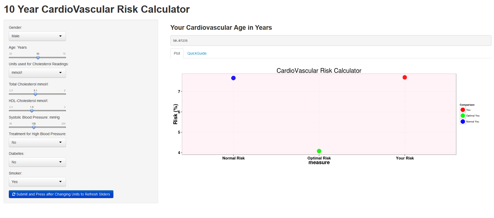

CardioVascular Risk 
========================================================


author: Tony Davidson

date: September 17 2014

  
What is Cardio Vascular Disease?
========================================================
transition:rotate


***
Cardio Vascular disease is a complicated way of saying there are problems with your heart and blood systems.


- It is the biggest cause of death world wide
- Since the 70's the mortality rates have been declining.
- What can you do to reduce your risk?


The CVR Calculator (Drivers)
========================================================

Key Drivers of Cardio Vascular Disease


You're Stuck with 

-sex

-age

***

You can Control (to some extent)

-Weight

-Cholesterol Levels (good and bad)

-Whether you smoke or not

-Blood Pressure

-Diabetes (Some genetic predisposition but can be minimised)


Your 10 year Cardio Vascular Risk
========================================================
transition:rotate
50 Year Old Woman Average Weight, Blood Pressure, Cholesterol Level. She is a smoker.

Her % Risk of having a Cardio Vascular episode is:

```
[1] 13.65
```
After she gives up smoking her % risk of a Cardio Vascular event is:

```
[1] 8.285
```
***
40 Year Old Man High Blood Pressure (Systolic 18) mmHg),  Average Blood Pressure and Cholesterol Level. 

His Cardio Vascular Risk is:

```
[1] 13.46
```
He reduces his Systolic blood pressure to 130 mmHg. His % risk is now:

```
[1] 7.415
```
Try the CardioVascular Risk Calculator
========================================================
transition:rotate



How can you and your loved ones reduce their risk?


